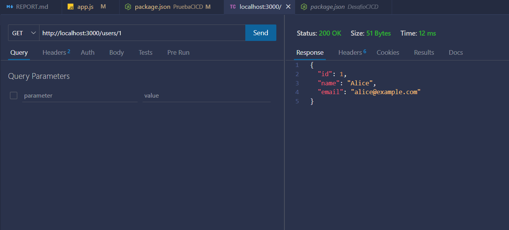

## Reporte e instrucciones

- Npm install -y

- Verificar correcto funcionamiento de app con "Postman" o "Thunder Client".

- Git init

 
- Touch .gitignore

 
- Touch README.md

- Git status
 
 

- Git add .

 
- Git commit -m “Commit inicial del proyecto.”

 
- Creacion repositorio remoto del proyecto

 
- Comandos para sincronizar proyecto al repo remoto:
    - git branch -M main
    - git remote add origin https://github.com/Isco16/PruebaCICD.git
    - git push -u origin main
 
 

 
- Touch Dockerfile con su respectivo código.
 
 
 

- Actualización del repo remoto para subir el archivo Dockerfile.
 

- Touch Jenkinsfile y su respectivo código.
 
 
 

- Subir nuevo archivo Jenkinsfile al repo remoto.
 
 
 

- Creación de pipeline de integración continua para el proyecto en Jenkins.
 
 
 
 
 

- Buildear el pipeline con las pruebas automatizadas y app dockerizada.

 
 
 
 

 # Resultados del pipeline

 - [Link reporte pdf](assets/reports/Reporte_4.pdf)
 - [Link reporte txt](assets/reports/#4.txt)